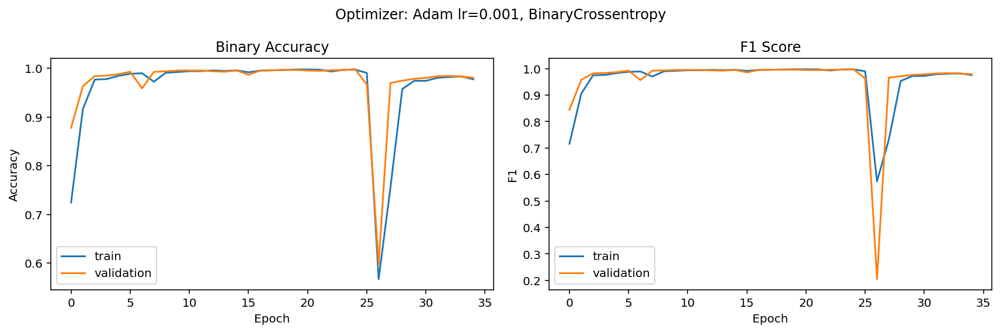
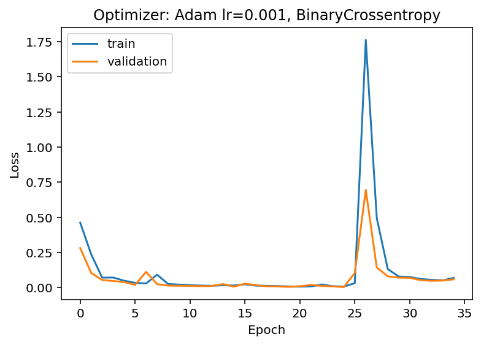

# Concrete Crack Detection — Binary Image Classification

A convolutional neural network that detects cracks in concrete deck images, achieving **99.9% binary accuracy and F1-score** on the held-out test set.

---

## Results

| Metric | Score |
|--------|-------|
| Binary Accuracy | **99.9%** |
| F1 Score | **99.9%** |
| Epochs to converge | ~25 |




---

## Quick Start

**1. Clone the repo and download the dataset**
```bash
git clone https://github.com/<your-username>/concrete-crack-detection.git
cd concrete-crack-detection
```

Download the **Decks** subset from Kaggle and place it at `archive (2)/Decks/`:
> https://www.kaggle.com/datasets/aniruddhsharma/structural-defects-network-concrete-crack-images

**2. Create the environment**
```bash
conda env create -f environment.yml
conda activate crack-detection
```

**3. Run the full pipeline**
```bash
python main.py
```

This preprocesses the raw images, trains the model, evaluates on the test set, and saves the best model to `models/`.

---

## Project Structure

```
├── src/                        # Shared, reusable modules
│   ├── preprocessing.py        # Image preprocessing pipelines
│   ├── model.py                # CNN architectures + custom loss/metrics
│   └── utils.py                # Display and memory utilities
│
├── experiments/                # Numbered scripts — the full R&D journey
│   ├── 00_initial_exploration.py
│   ├── 01_dev_exploration.py
│   ├── 02_preprocessing_pipelines.py
│   ├── 03_model_architecture_search.py
│   ├── 04_pipeline_1_0_evaluation.py   # → 80% accuracy
│   └── 05_pipeline_1_1_evaluation.py   # → 99.9% accuracy
│
├── models/                     # Saved model weights and performance plots
├── datasets/                   # Preprocessed .npy datasets (not committed)
├── data/                       # Raw data placeholder (not committed)
│
├── main.py                     # Clean end-to-end training entry point
├── environment.yml             # Conda environment (pins CUDA + all deps)
└── requirements.txt            # Pip-only alternative
```

---

## How It Works

### The Problem

Cracked and non-cracked concrete deck images are severely imbalanced — roughly **10× more solid images** than cracked ones. A naive model will simply predict "solid" for every input and still achieve ~90% accuracy while being completely useless.

### Step 1 — Preprocessing Pipeline

Two binarization pipelines were developed and compared:

| Pipeline | Method | Result |
|----------|--------|--------|
| **1.0** | Red channel → CLAHE → global Otsu threshold | 80% accuracy |
| **1.1** | Red channel → CLAHE → local threshold (block=41) | **99.9% accuracy** |

The key insight: global Otsu thresholding was **erasing faint cracks** by averaging them into the background. Local thresholding adapts to each image region and preserves them.

Cracked images were augmented **5× per image** (original + 4 mirror flips: vertical, horizontal, main diagonal, anti-diagonal) to address the class imbalance.

### Step 2 — Model Architecture

Three architectures were evaluated on the same dataset:

| Version | Architecture | Key change |
|---------|-------------|------------|
| `build_model_v1` | MaxPool → Conv(16) → Conv(8) → Flatten → Dense | FocalLoss + SGD |
| `build_model_v2` | Conv(16) → MaxPool → Conv(8) → MaxPool → GAP → Dense | Switched to Adam + BCE |
| `build_model_v3` | Conv(32,s=3) → MaxPool → Conv(64) → MaxPool → Conv(128) → GAP → Dense×4 | **Best — 99.9%** |

`build_model_v3` uses a strided first convolution (stride=3) to aggressively downsample 256×256 images before the expensive convolutional layers, making training fast on GPU without sacrificing accuracy.

### Why the Jump from 80% to 99.9%?

The model architecture was not the bottleneck — `build_model_v2` was already capable enough. The breakthrough came entirely from switching the preprocessing from global to local thresholding (pipeline 1.1), which allowed the model to see cracks that were previously invisible after binarization.

---

## Model Architecture (best)

```
Input (256×256×1)
│
├─ Conv2D (32 filters, 16×16, stride=3)  →  LeakyReLU
├─ MaxPooling2D (3×3)
├─ Conv2D (64 filters, 8×8)              →  LeakyReLU
├─ MaxPooling2D (2×2)
├─ Conv2D (128 filters, 4×4)             →  LeakyReLU
├─ GlobalAveragePooling2D
├─ Dense (64)  →  LeakyReLU
├─ Dense (32)  →  LeakyReLU
├─ Dense (32)  →  LeakyReLU
├─ Dense (32)  →  LeakyReLU
└─ Dense (1)   →  Sigmoid
```

**Optimizer:** Adam (lr=0.001)  
**Loss:** BinaryCrossentropy  
**Callbacks:** ModelCheckpoint + EarlyStopping (patience=10)

---

## Dataset

**Structural Defects Network: Concrete Crack Images** — Kaggle  
Only the **Decks** subset is used (cracked + non-cracked).

> https://www.kaggle.com/datasets/aniruddhsharma/structural-defects-network-concrete-crack-images

The preprocessed `.npy` files and raw images are not committed to this repo due to size. Follow the Quick Start instructions to regenerate them.

---

## Environment

TensorFlow 2.10.0 is the **last version with native Windows GPU support**.  
Upgrading TensorFlow on Windows will disable GPU training.

```bash
conda env create -f environment.yml   # recommended — handles CUDA automatically
conda activate crack-detection

# or, for CPU / cloud environments:
pip install -r requirements.txt
```
